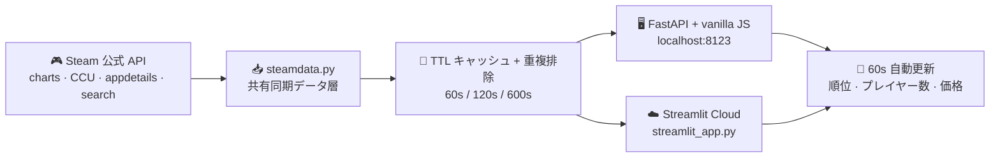

<div align="center">


# Steam Live Charts

**Steam リアルタイムランキング——トップセラー · 最もプレイ · 特価、60 秒ごとに自動更新**

[](https://github.com/Mocas-12/steam-live-charts/actions/workflows/ci.yml)
[](https://www.python.org)
[](#-仕組み)
[](https://steam-live-charts.streamlit.app/)
[](#-特徴)

**[🌐 ライブチャート (Streamlit Cloud)](https://steam-live-charts.streamlit.app/)**

[English](./README.md) | [简体中文](./README.zh-CN.md) | **日本語**

*ページを開く → トップセラー・最もプレイ・特価を眺める → すべてが 60 秒ごとに自ら更新*

</div>

---

## 📖 目次

- [特徴](#-特徴)
- [仕組み](#-仕組み)
- [使い方](#-使い方)
- [プロジェクト構成](#-プロジェクト構成)
- [クイックスタート](#-クイックスタート)
- [デプロイ](#-デプロイ)
- [カスタマイズ](#-カスタマイズ)
- [FAQ](#-faq)
- [ライセンス](#-ライセンス)

## ✨ 特徴

- 🏆 **6 つのライブランキング**（デフォルト表示は Most Played）：Most Played（Top 100）· Top Sellers（Top 50）· Specials（Top 50）· New Releases（Top 30）· Free Games（Top 50）· Free To Keep（100% オフの無償配布。開催中がなければ空状態）
- 🕹️ **シネマティックテーマ**：コンテンツ第一のダークデザイン——カバー art が主役。角の丸いカード、ゴールドのアクセント、トップ 3 の金属ランキング数字（金 / 銀 / 銅）、等幅フォントの統計数字。あえて Steam のクローンにはしない
- 📊 **ライブティッカー & スタットカード**：上部に人気タイトルのマーキー。ワイド画面ではサイドカードに「今プレイ中 TOP 3」、TOP100 合計同時接続数、更新時刻を表示
- 👥 **リアルタイムプレイヤー数**：全ゲームを Steam 公式統計 API に個別問い合わせ——Most Played は**現在の**同時接続数で並べ替え、本日のピークと週間順位変動（▲ 上昇 / ▼ 低下 / NEW）を表示
- 💰 **人民元価格 & セールタグ**：柔らかいグリーンの割引ピル + 打ち消し線入り定価
- 🀄 **簡体字中国語ローカライズ**：タイトル・ジャンル・カバー art（`cc=cn&l=schinese`）
- 🔄 **60 秒自動更新**：FastAPI 版はカウントダウン + 手動リフレッシュ、Streamlit 版は `st.fragment` のインプレース再実行——どちらも現在のタブを失わない
- 🧯 **しぶといフォールバック**：削除・地域ロック済みタイトル（Rocket League など）は Steam コミュニティページから名前を取得。上流が不調でも古いキャッシュで応答。Steam が検索マークアップを変えたら解析センチネルが黙ってボードを空にするのではなく、エラーを raise
- 📈 **24 時間トレンド スパークライン**：Most Played の全行に、傾向で色分きした 24 時間ローリング プレイヤー数スパークライン（緑 上昇 / 赤 低下 / 金 横ばい。サーバ稼働中はメモリ内でサンプリング、完全なリングは `/api/history/{appid}`）——FastAPI 版のみ
- 📡 **デイリーブリーフィング バー**：ヘッダー直下の一目ライン——現在の総接続数、🔥 急上昇ゲーム（30 分窓 vs 2 時間ベースライン）、新登場、開催中の無償配布——訪問から 3 秒で何が変わったか分かる
- ⭐ **ウォッチリスト**（FastAPI 版）：ゲームに星を付けてフォロー。「★ 我的关注」をワンクリックで全ボードをお気に入りに絞り込み、フォロー中のゲームの割引が深まった瞬間に星が緑に
- ✨ **控えめなライブモーション**：プレイヤー数は変化時にゴールドにフラッシュ、カバーはホバーでわずかにズーム、急上昇バッジは呼吸——意図的に控えめで、シネマティックな静けさは保たれる
- 🔍 **ボード内フィルタ**：ゲーム名を打てば表示中のボードを即座に絞り込み——FastAPI 版は全タブ共通の 1 ボックス、Streamlit 版はタブごと
- 🔔 **Free To Keep のプッシュ通知**：`NTFY_TOPIC` 環境変数を設定すれば、新しい 100% オフ無償配布が出現した瞬間に ntfy.sh 通知（デフォルト OFF）
- 🗂️ **デイリースナップショット**：スケジュールされた GitHub Action が毎日北京時間の深夜に全 6 ボードを `archive/YYYY-MM-DD.json` に固定
- 🖥️ **2 つのフロントエンド、1 つのデータ層**：手作り FastAPI + vanilla JS サイトと、同じ `steamdata.py` を共有する Streamlit Cloud 版
- 📱 **インストール可能な PWA**：FastAPI 版は Web マニフェスト + アイコンを同梱。「ホーム画面に追加」でアプリのようなライブボードに

## 🧠 仕組み



1. **取得**：Top Sellers / Specials / Free Games はストア検索エンドポイントを `TopSellers` ソートで取得（割引は `specials=1`、無料ボードは `maxprice=free`——真に無料のタイトルのみにフィルタ）。**Free To Keep** は `specials=1 & maxprice=free` の交差から -100% 割引行のみを抽出（Steam にそういうチャートはないため、無償配布がなければタブはフレンドリーな空状態を表示）。New Releases は厳選 `featuredcategories` フィードから。Most Played の骨格は `GetMostPlayedGames`、その後各ゲームのライブ プレイヤー数を個別取得（`GetNumberOfCurrentPlayers`、同時実行 20）
2. **並べ替え**：公式チャートは日次集計のため、Most Played は「リアルタイム」に忠実であるよう*現在の*プレイヤー数でソート。価格 / 名称 / ジャンルは `appdetails`（10 分キャッシュ）
3. **フォールバック**：ストアページが消えたゲーム（削除 / 地域ロック）は Steam コミュニティ ハブのタイトルへフォールバック。上流失敗時はエラーではなく古いキャッシュを返す
4. **描画**：FastAPI アプリはカウントダウン ポーリング付きの手書き Steam 風サイトを配信。Streamlit アプリは `st.markdown` + `st.fragment(run_every="60s")` で同じデザイン言語を注入

## 📖 使い方

- **タブ**：6 つのランキング——自由に切り替え、各タブはその場で自己更新
- **Most Played**：# 列はライブ プレイヤー数に追従。右側に「当前在线（現在の接続数）」と「今日峰值（本日のピーク）」。周变化は先週の公式チャートと比較（▲ 上昇 / ▼ 低下 / 新上榜 NEW）
- **価格**：常に人民元（データリージョン `cc=cn`）。割引ブロックはパーセント + 最終価格、定価に打ち消し線
- **更新**：60 秒カウントダウンを待つか、↻ 刷新を押すか、F5——どちらでもバックエンドのキャッシュが Steam のレート制限に配慮します

## 📁 プロジェクト構成

```text
steam-live-charts/
├── app.py               # FastAPI バックエンド：TTL キャッシュ + 履歴リング + ntfy ウォッチドッグ + 静的ホスティング
├── steamdata.py         # 共有同期データ層（両フロントエンドで使用）
├── streamlit_app.py     # Streamlit Cloud エントリ：テーマ CSS + タブ + 60s 自動更新 fragment
├── run.bat              # Windows ワンクリック起動（ポート 8123）
├── static/              # フロントエンド（index.html / steam.css / app.js + PWA マニフェスト & アイコン）
├── tests/               # オフライン単体テスト（steamdata 解析 + TTLCache + 履歴リング）
├── scripts/
│   └── snapshot.py      # 6 ボードのデイリーアーカイブ出力（GitHub Actions が実行）
├── archive/             # デイリースナップショット：YYYY-MM-DD.json（Action がコミット）
├── .streamlit/          # config.toml（ダークテーマ）
├── docs/
│   └── index.html       # GitHub Pages リダイレクトページ（Streamlit Cloud へ転送）
├── LICENSE              # MIT
└── logo.svg             # プロジェクトロゴ
```

## 🚀 クイックスタート

**方法 A · FastAPI オリジナルの見た目**

```bash
git clone https://github.com/Mocas-12/steam-live-charts.git
cd steam-live-charts
pip install fastapi "uvicorn[standard]" httpx  # 最小構成。requirements.txt は Streamlit 込みのフルセット
python -m uvicorn app:app --host 127.0.0.1 --port 8123
# Windows は run.bat をダブルクリック
```

http://127.0.0.1:8123/ を開く——JSON API は `/api/*`（top-sellers / most-played / specials / new-releases / free-games / free-to-keep / briefing / history/{appid}）、生存プローブは `/healthz`。

**方法 B · Streamlit**

```bash
pip install -r requirements.txt
streamlit run streamlit_app.py
```

## 🌐 デプロイ

**Streamlit Community Cloud（すでに稼働中）**

1. このリポジトリをフォークまたは push。https://share.streamlit.io/ で **`streamlit_app.py`** を指すアプリを作成（ブランチ `master`）
2. `master` への push ごとに自動再デプロイ
3. ⚠️ `app.py` は FastAPI バックエンドです——Streamlit Cloud が実行できるのは `streamlit_app.py` のみ

> 見栄えのする静的エントリとして、`docs/index.html` が GitHub Pages サイトをライブ アプリへリダイレクトします（リポジトリ Settings → Pages → `/docs` からデプロイ）。

**セルフホスト**

```bash
pip install fastapi "uvicorn[standard]" httpx
python -m uvicorn app:app --host 0.0.0.0 --port 8123
```

```dockerfile
FROM python:3.12-slim
WORKDIR /app
COPY . .
RUN pip install -U fastapi "uvicorn[standard]" httpx
EXPOSE 8123
CMD ["python","-m","uvicorn","app:app","--host","0.0.0.0","--port","8123"]
```

## 🛠️ カスタマイズ

- **リージョン & 言語**：`steamdata.py` の `CC` / `LANG`（`cc=cn&l=schinese` → 人民元 + 簡体字中国語）
- **更新間隔**：`app.py` の `REFRESH_SECONDS`、キャッシュの `ttl` 値、`streamlit_app.py` の `run_every="60s"`
- **ランキングサイズ**：`fetch_search()` の `count=50` と `build_most_played(top_n=100)`
- **Free To Keep のプッシュ**：`NTFY_TOPIC` 環境変数に任意の ntfy.sh トピック名を設定（秘密として扱うこと——同じトピックを購読した人はあなたのプッシュを受け取れます。ntfy アプリをインストールして購読すれば配信される）。未設定なら無効
- **テーマ**：`static/steam.css` 上部のデザイン トークン。Streamlit 版は `streamlit_app.py` の CSS ブロック + `.streamlit/config.toml` を編集

## ❓ FAQ

<details>
<summary><b>Most Played の初回ロードが遅いのは？</b></summary>

コールド スタートでは 100 ゲームを 1 件ずつ問い合わせます（プレイヤー数 + 詳細、Streamlit Cloud で約 10〜20 秒）。結果は 60 秒 / 600 秒キャッシュされるため、再読み込みは高速です。
</details>

<details>
<summary><b>一部の項目が「App 123456」と表示されるのは？</b></summary>

そのゲームにはストアページがなく（未発売のプレイテスト、地域ロック版）、コミュニティ ハブもないため、名前の取得元が残っていません。通常は自然にチャートから消えます。
</details>

<details>
<summary><b>カバー画像が欠けることがあるのは？</b></summary>

新しいゲームはハッシュ化 CDN パス（`store_item_assets/...`）のみを公開します。ロードに失敗した画像は自動で非表示になり、順位バッジは残ります。再読み込みで通常は埋まります。
</details>

<details>
<summary><b>Streamlit Cloud で白いページが出る？</b></summary>

メイン ファイルのパスは `streamlit_app.py` でなければなりません——`app.py` は FastAPI であり Streamlit Cloud では実行できません。壊れたデプロイ記録が残っている場合は、アプリの ⋮ → Reboot で解消します。
</details>

## 📄 ライセンス

- [MIT License](./LICENSE) で公開。Valve Corporation と提携のない非公式サードパーティ ツールです。ゲーム名・カバー art・価格は Valve と各開発者に帰属します。Steam 公開 API のレート制限を尊重してください。

---

<div align="center">

**Made with 💙**

🌐 [ライブチャート](https://steam-live-charts.streamlit.app/) · 🐛 [Issue を報告](https://github.com/Mocas-12/steam-live-charts/issues)

</div>
