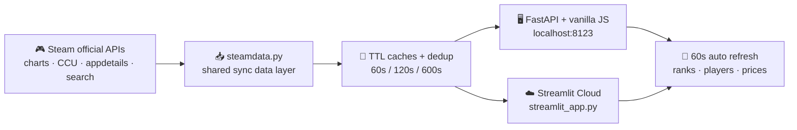

<div align="center">


# Steam Live Charts

**Real-time Steam leaderboards — Top Sellers · Most Played · Specials, auto-refreshed every 60 seconds**

[](https://github.com/Mocas-12/steam-live-charts/actions/workflows/ci.yml)
[](https://www.python.org)
[](#-how-it-works)
[](https://steam-live-charts.streamlit.app/)
[](#-features)

**[🌐 Live Charts (Streamlit Cloud)](https://steam-live-charts.streamlit.app/)**

**English** | [简体中文](./README.zh-CN.md) | [日本語](./README.ja-JP.md)

*Open the page → browse Top Sellers, Most Played and Specials → everything refreshes itself every 60 seconds*

</div>

---

## 📖 Table of Contents

- [Features](#-features)
- [How It Works](#-how-it-works)
- [Usage Guide](#-usage-guide)
- [Project Structure](#-project-structure)
- [Quick Start](#-quick-start)
- [Deployment](#-deployment)
- [Customization](#️-customization)
- [FAQ](#-faq)
- [License](#-license)

## ✨ Features

- 🏆 **Six live leaderboards** (Most Played opens by default): Most Played (Top 100) · Top Sellers (Top 50) · Specials (Top 50) · New Releases (Top 30) · Free Games (Top 50) · Free To Keep (100%-off giveaways, empty-state when no promo is live)
- 🎨 **Aurora Glass theme** (2026 design language): liquid-glass surfaces on a deep-space backdrop with dual aurora glows — brand gold (fire) × electric blue (ice) — film-grain texture, oversized gradient typography, and gradient gold/silver/bronze rank numerals; deliberately *not* a Steam clone
- 📊 **Live ticker & stat cards**: a marquee of hot items across the top; on wide screens, side cards show the playing-now TOP 3, TOP100 total online and refresh time
- 👥 **Real-time player counts**: every game is queried individually against Steam's official stats API — the Most Played board is re-ranked by *current* concurrent players and shows today's peak plus weekly rank movement (▲ up / ▼ down / NEW)
- 💰 **CNY prices & deal tags**: soft green discount pills with struck-through original prices
- 🀄 **Simplified Chinese**: localized titles, genres and cover art (`cc=cn&l=schinese`)
- 🔄 **Auto refresh every 60s**: countdown + manual refresh on the FastAPI site; `st.fragment` in-place rerun on Streamlit — neither loses your current tab
- 🧯 **Resilient fallbacks**: delisted / region-locked games (e.g. Rocket League) get their names from Steam Community pages; stale cache is served when upstream hiccups; a parse-layout sentinel raises instead of silently blanking a board if Steam ever changes its search markup
- 📈 **24h trend sparklines**: every Most Played row carries a rolling 24-hour player-count sparkline colored by trend (green up / red down / gold flat; sampled in memory while the server runs, full ring at `/api/history/{appid}`) — FastAPI site only
- 📡 **Daily briefing strip**: an at-a-glance line under the header — total online now, 🔥 surging games (30-min window vs 2-hour baseline), new entries, live giveaways — every visit tells you what changed in 3 seconds
- ⭐ **Watchlist** (FastAPI site): star any game to follow it, one click on "★ 我的关注" filters every board to your stars, and a star turns green the moment a watched game's discount deepens
- ✨ **Restrained live motion**: player counts flash gold when they change, covers zoom slightly on hover, surge badges breathe — deliberately subtle, the Aurora calm stays
- 🔍 **In-board filter**: type a game name to instantly filter the visible board — one box for all tabs on the FastAPI site, per-tab boxes on Streamlit
- 🔔 **Free-to-keep push**: set the `NTFY_TOPIC` env var and get an ntfy.sh notification the moment a new 100%-off giveaway appears (off by default)
- 🗂️ **Daily snapshots**: a scheduled GitHub Action freezes all six boards into `archive/YYYY-MM-DD.json` every day at Beijing midnight
- 🖥️ **Two frontends, one data layer**: a hand-crafted FastAPI + vanilla JS site and a Streamlit Cloud replica sharing the same `steamdata.py`
- 📱 **Installable PWA**: the FastAPI site ships a web manifest + icons, so "Add to Home Screen" gives you an app-like live board

## 🧠 How It Works



1. **Fetch**: the Top Sellers / Specials / Free Games boards come from the store search endpoint sorted by `TopSellers` (with `specials=1` for discounts, `maxprice=free` — filtered to truly-free titles — for the free board); **Free To Keep** is the intersection of `specials=1 & maxprice=free` keeping only -100% discount rows (Steam has no such chart, so the tab shows a friendly empty state when no giveaway is live); New Releases come from the curated `featuredcategories` feed. The Most Played skeleton comes from `GetMostPlayedGames`, then each game's live player count is fetched individually (`GetNumberOfCurrentPlayers`, concurrency 20)
2. **Re-rank**: the official chart is a daily rollup, so the Most Played board is sorted by *current* players to stay honest to "real-time"; prices/names/genres come from `appdetails` (10-min cache)
3. **Fallbacks**: games whose store entry is gone (delisted / region-locked) fall back to the Steam Community hub title for their name; upstream failures serve stale cache instead of an error
4. **Render**: the FastAPI app serves a hand-written Steam-styled site with countdown polling; the Streamlit app injects the same design language over `st.markdown` + `st.fragment(run_every="60s")`

## 📖 Usage Guide

- **Tabs**: six leaderboards — switch freely, each tab refreshes itself in place
- **Most Played**: the # column follows live player counts; 当前在线 (current players) and 今日峰值 (today's peak) are on the right; 周变化 compares against last week's official chart (▲ rose / ▼ fell / 新上榜 NEW)
- **Prices**: always CNY (data region `cc=cn`); discount blocks show percent + final price with the original struck through
- **Refresh**: wait for the 60s countdown, hit ↻ 刷新, or press F5 — backend caches keep Steam's rate limits happy either way

## 📁 Project Structure

```text
steam-live-charts/
├── app.py               # FastAPI backend: TTL caches + history ring + ntfy watchdog + static hosting
├── steamdata.py         # Shared sync data layer (used by both frontends)
├── streamlit_app.py     # Streamlit Cloud entry: theme CSS + tabs + 60s auto-refresh fragments
├── run.bat              # One-click start on Windows (port 8123)
├── static/              # Frontend (index.html / steam.css / app.js + PWA manifest & icons)
├── tests/               # Offline unit tests (steamdata parsing + TTLCache + history ring)
├── scripts/
│   └── snapshot.py      # Six-board daily archive writer (run by GitHub Actions)
├── archive/             # Daily snapshots: YYYY-MM-DD.json (committed by the Action)
├── .streamlit/          # config.toml (dark theme)
├── docs/
│   └── index.html       # GitHub Pages redirect page (forwards to Streamlit Cloud)
├── LICENSE              # MIT
└── logo.svg             # Project logo
```

## 🚀 Quick Start

**Option A · FastAPI original look**

```bash
git clone https://github.com/Mocas-12/steam-live-charts.git
cd steam-live-charts
pip install fastapi "uvicorn[standard]" httpx  # minimal deps; requirements.txt is the full bundle incl. Streamlit
python -m uvicorn app:app --host 127.0.0.1 --port 8123
# Windows: double-click run.bat
```

Open http://127.0.0.1:8123/ — the JSON APIs live under `/api/*` (top-sellers / most-played / specials / new-releases / free-games / free-to-keep / briefing / history/{appid}), liveness probe at `/healthz`.

**Option B · Streamlit**

```bash
pip install -r requirements.txt
streamlit run streamlit_app.py
```

## 🌐 Deployment

**Streamlit Community Cloud (already live)**

1. Fork or push this repo; on https://share.streamlit.io/ create an app pointing at **`streamlit_app.py`** (branch `master`)
2. Every push to `master` redeploys automatically
3. ⚠️ `app.py` is the FastAPI backend — Streamlit Cloud can only run `streamlit_app.py`

> For a pretty static entry, `docs/index.html` redirects a GitHub Pages site to the live app (repo Settings → Pages → deploy from `/docs`).

**Self-hosted**

```bash
pip install fastapi "uvicorn[standard]" httpx
python -m uvicorn app:app --host 0.0.0.0 --port 8123
```

```dockerfile
FROM python:3.12-slim
WORKDIR /app
COPY . .
RUN pip install -U fastapi "uvicorn[standard]" httpx
EXPOSE 8123
CMD ["python","-m","uvicorn","app:app","--host","0.0.0.0","--port","8123"]
```

## 🛠️ Customization

- **Region & language**: `CC` / `LANG` in `steamdata.py` (`cc=cn&l=schinese` → CNY + Simplified Chinese)
- **Refresh cadence**: `REFRESH_SECONDS` in `app.py`, cache `ttl` values, and `run_every="60s"` in `streamlit_app.py`
- **Leaderboard size**: `count=50` in `fetch_search()` and `build_most_played(top_n=100)`
- **Free-to-keep push**: set the `NTFY_TOPIC` environment variable to any ntfy.sh topic name (treat it as a secret — anyone subscribing to the same topic receives your pushes; install the ntfy app and subscribe to enable delivery). Leave unset to disable
- **Theme**: design tokens at the top of `static/steam.css`; the Streamlit mirror edits the CSS block in `streamlit_app.py` + `.streamlit/config.toml`

## ❓ FAQ

<details>
<summary><b>Why is the first load of "Most Played" slow?</b></summary>

Cold start queries 100 games one-by-one (player counts + details, ~10–20s on Streamlit Cloud). Results are cached for 60s/600s, so refreshes are fast.
</details>

<details>
<summary><b>Why do a few entries show "App 123456"?</b></summary>

Those games have no store page (unreleased playtests, region-locked builds) and no community hub either, so no name source remains. They usually disappear from the charts on their own.
</details>

<details>
<summary><b>Why is a cover image missing?</b></summary>

New games only expose hashed CDN paths (`store_item_assets/...`); when one fails to load the image hides itself and the rank badge stays. Refreshing usually backfills it.
</details>

<details>
<summary><b>Streamlit Cloud shows a blank page?</b></summary>

The main file path must be `streamlit_app.py` — `app.py` is FastAPI and cannot run on Streamlit Cloud. If a broken deployment record sticks, a ⋮ → Reboot on the app clears it.
</details>

## 📄 License

- Released under the [MIT License](./LICENSE). This is an unofficial third-party tool with no affiliation to Valve Corporation; game names, cover art and prices belong to Valve and the respective developers. Please respect Steam's public API rate limits.

---

<div align="center">

**Made with 💙**

🌐 [Live Charts](https://steam-live-charts.streamlit.app/) · 🐛 [Report an Issue](https://github.com/Mocas-12/steam-live-charts/issues)

</div>
