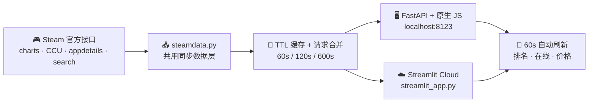

<div align="center">


# Steam Live Charts

**实时 Steam 游戏榜单 —— 热销商品 · 最热游玩 · 特惠专区，每 60 秒自动刷新**

[](https://github.com/Mocas-12/steam-live-charts/actions/workflows/ci.yml)
[](https://www.python.org)
[](#-工作原理)
[](https://steam-live-charts.streamlit.app/)
[](#-功能特性)

**[🌐 在线榜单 (Streamlit Cloud)](https://steam-live-charts.streamlit.app/)**

[English](./README.md) | **简体中文**

*打开页面 → 浏览热销、最热、特惠三大榜单 → 全部数据每 60 秒自动更新*

</div>

---

## 📖 目录

- [功能特性](#-功能特性)
- [工作原理](#-工作原理)
- [使用指南](#-使用指南)
- [项目结构](#-项目结构)
- [快速开始](#-快速开始)
- [部署上线](#-部署上线)
- [自定义](#-自定义)
- [常见问题](#-常见问题)
- [许可](#-许可)

## ✨ 功能特性

- 🏆 **六大实时榜单**（默认打开最热游玩）：最热游玩（Top 100）· 热销商品（Top 50）· 特惠专区（Top 50）· 新品上架（Top 30）· 免费游戏（Top 50）· 限时免费入库（-100% 折扣赠送，无活动时显示空状态）
- 🕹️ **Cinematic 主题**：内容优先的电影感暗色设计——让封面当主角，大圆角卡片、金色点睛、前三名金银铜排名数字、等宽数据字体；刻意与 Steam 官方界面区分开
- 📊 **滚动资讯条 + 实时数据卡**：顶部跑马灯滚动热榜摘要；宽屏两侧显示「此刻在线 TOP 3」小卡与 TOP100 总在线等实时统计
- 👥 **真实时在线人数**：每款游戏逐个查询 Steam 官方统计接口，最热榜按**当前在线人数**实时重排，附今日峰值与周名次变化（▲ 上升 / ▼ 下降 / 新上榜）
- 💰 **人民币价格 + 折扣标签**：柔和绿折扣 pill、划线原价
- 🀄 **简体中文**：游戏名、类型标签、中文封面（`cc=cn&l=schinese`）
- 🔄 **60 秒自动刷新**：FastAPI 版倒计时轮询、Streamlit 版 `st.fragment` 原地刷新，都不会打断你正在看的 tab
- 🧯 **多级兜底**：已下架/区域锁游戏（如 Rocket League）从 Steam 社区页取名字；上游接口抖动时回退过期缓存而不是报错
- 🖥️ **一套数据层、两种前端**：手工打造的高速 FastAPI + 原生 JS 站点，和共享同一份 `steamdata.py` 的 Streamlit Cloud 版

## 🧠 工作原理



1. **抓取**：热销/特惠/免费榜来自商店搜索接口（`sort_by=TopSellers`，特惠加 `specials=1`，免费榜加 `maxprice=free` 并过滤掉混入的免费试玩付费游戏）；**限时免费**取 `specials=1` 与 `maxprice=free` 的交集、只留 -100% 折扣行（Steam 没有现成榜单，无活动时显示友好空状态）；新品榜来自商店精选 `featuredcategories`；最热榜骨架来自 `GetMostPlayedGames`，再逐款并发查询实时在线人数（`GetNumberOfCurrentPlayers`，并发 20）
2. **重排**：官方榜是每日快照，与实时在线有出入——最热榜按当前在线人数重新排序，价格/名字/类型来自 `appdetails`（10 分钟缓存）
3. **兜底**：无商店页的游戏从 Steam 社区页标题取名字；上游失败时返回过期缓存兜底
4. **渲染**：FastAPI 版托管手写 Steam 风格站点（倒计时轮询）；Streamlit 版用 `st.markdown` + `st.fragment(run_every="60s")` 注入同一套设计语言

## 📖 使用指南

- **Tab 切换**：六大榜单自由切换，每个 tab 各自原地刷新
- **最热游玩**：# 列按实时在线排序；右侧为当前在线与今日峰值；周变化对照上周官方榜（▲ 上升 / ▼ 下降 / 新上榜）
- **价格**：全部人民币（数据区域 `cc=cn`）；折扣块显示折扣率 + 到手价，原价划线
- **刷新**：等 60 秒倒计时、点 ↻ 刷新或直接 F5，后端缓存会替你控制好请求频率

## 📁 项目结构

```text
steam-live-charts/
├── app.py               # FastAPI 后端：TTL 缓存 + 静态站点托管（数据走 steamdata）
├── steamdata.py         # 共用同步数据层（两个前端共用）
├── streamlit_app.py     # Streamlit Cloud 入口：主题 CSS + 榜单 tab + 60s 自动刷新
├── run.bat              # Windows 一键启动（端口 8123）
├── static/              # Steam 风格前端（index.html / steam.css / app.js）
├── tests/               # 离线单元测试（steamdata 解析 + TTLCache）
├── .streamlit/          # config.toml（暗色主题）
├── docs/
│   └── index.html       # GitHub Pages 跳转页（转发到 Streamlit Cloud）
├── LICENSE              # MIT
└── logo.svg             # 项目 logo
```

## 🚀 快速开始

**方案 A · FastAPI 原版视觉**

```bash
git clone https://github.com/Mocas-12/steam-live-charts.git
cd steam-live-charts
pip install fastapi "uvicorn[standard]" httpx  # 最小依赖；requirements.txt 是含 Streamlit 的全量包
python -m uvicorn app:app --host 127.0.0.1 --port 8123
# Windows 可直接双击 run.bat
```

打开 http://127.0.0.1:8123/ ；JSON 接口在 `/api/top-sellers`、`/api/most-played`、`/api/specials`。

**方案 B · Streamlit**

```bash
pip install -r requirements.txt
streamlit run streamlit_app.py
```

## 🌐 部署上线

**Streamlit Community Cloud（已上线）**

1. Fork 或 push 本仓库；在 https://share.streamlit.io/ 创建应用，Main file path 选 **`streamlit_app.py`**（分支 `master`）
2. 每次 push 到 `master` 自动重新部署
3. ⚠️ `app.py` 是 FastAPI 后端，Streamlit Cloud 只能跑 `streamlit_app.py`

> 想要好看的静态入口，可启用 GitHub Pages（仓库 Settings → Pages → 选 `/docs` 目录），`docs/index.html` 会自动跳转到在线榜单。

**自托管**

```bash
pip install fastapi "uvicorn[standard]" httpx
python -m uvicorn app:app --host 0.0.0.0 --port 8123
```

```dockerfile
FROM python:3.12-slim
WORKDIR /app
COPY . .
RUN pip install -U fastapi "uvicorn[standard]" httpx
EXPOSE 8123
CMD ["python","-m","uvicorn","app:app","--host","0.0.0.0","--port","8123"]
```

## 🛠️ 自定义

- **区域与语言**：`steamdata.py` 里的 `CC` / `LANG`（`cc=cn&l=schinese` → 人民币 + 简体中文）
- **刷新频率**：`app.py` 的 `REFRESH_SECONDS`、各缓存 `ttl`，以及 `streamlit_app.py` 的 `run_every="60s"`
- **榜单长度**：`fetch_search()` 的 `count=50` 与 `build_most_played(top_n=100)`
- **主题配色**：`static/steam.css` 顶部的设计变量；Streamlit 版改 `streamlit_app.py` 里的 CSS 块和 `.streamlit/config.toml`

## ❓ 常见问题

<details>
<summary><b>最热游玩榜第一次打开为什么慢？</b></summary>

冷启动要逐个查询 100 款游戏（在线人数 + 详情，Streamlit Cloud 上约 10–20 秒）。结果缓存 60s/600s，之后刷新就快了。
</details>

<details>
<summary><b>为什么个别条目显示 "App 123456"？</b></summary>

这些游戏没有商店页（未发售的测试版、区域锁构建），社区页也不存在，所有名字来源都失效。它们通常很快会自己跌出榜单。
</details>

<details>
<summary><b>为什么个别封面图没显示？</b></summary>

新游戏只有哈希化 CDN 路径（`store_item_assets/...`），加载失败时会自动隐藏图片只留排名角标，下次刷新一般会补上。
</details>

<details>
<summary><b>Streamlit Cloud 打开是空白？</b></summary>

Main file path 必须是 `streamlit_app.py`——`app.py` 是 FastAPI，无法在 Streamlit Cloud 运行。如果部署记录卡死，在面板 ⋮ 菜单里 Reboot 一下即可。
</details>

## 📄 许可

- 本项目以 [MIT 许可证](./LICENSE) 开源。本项目为非官方第三方工具，与 Valve Corporation 无从属关系；游戏名称、封面图与价格版权归 Valve 及相应开发商所有。请尊重 Steam 公开接口的频率限制。

---

<div align="center">

**Made with 💙**

🌐 [在线榜单](https://steam-live-charts.streamlit.app/) · 🐛 [报告问题](https://github.com/Mocas-12/steam-live-charts/issues)

</div>
